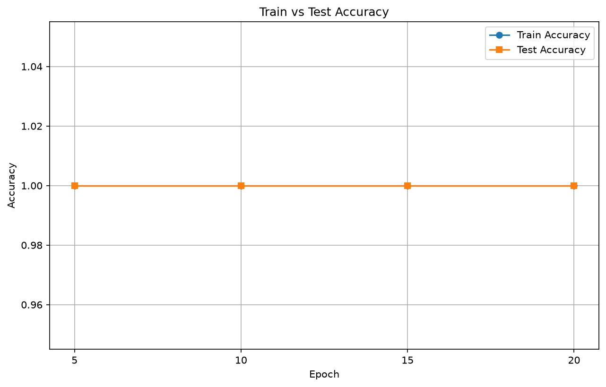
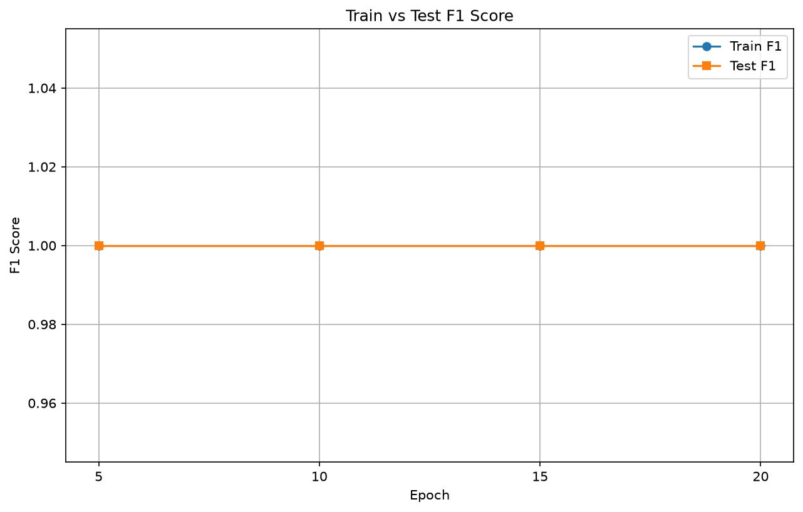
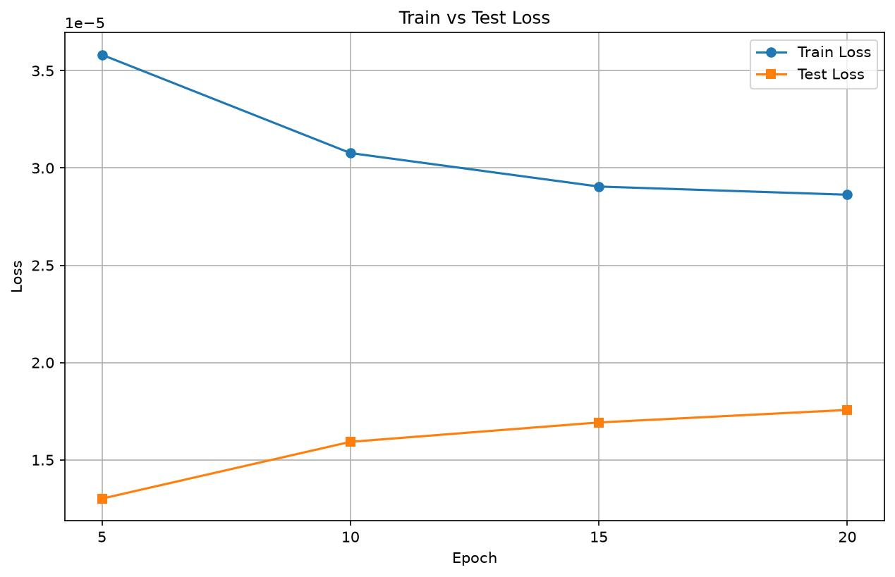

# xLSTM for Genomic Sequence Classification

This project implements an xLSTM (Extended LSTM) model for classifying genomic DNA sequences as coding vs. intergenomic regions using the Hugging Face Genomic Benchmarks dataset.

## Overview

The xLSTM architecture combines two LSTM variants:
- **sLSTM (Scalar LSTM)**: Uses exponential gates for numerical stability
- **mLSTM (Matrix LSTM)**: Uses matrix memory for enhanced information processing

The model is trained on cDNA sequences to distinguish between coding and intergenomic regions, achieving high accuracy due to the distinct sequence patterns in these genomic regions.

## Dataset

- **Name**: `katarinagresova/Genomic_Benchmarks_demo_coding_vs_intergenomic_seqs`
- **Task**: Binary classification (coding vs. intergenomic sequences)
- **Splits**: Official train/test splits from Hugging Face
- **Samples Used**: 20,000 training samples, 5,000 test samples
- **Sequence Length**: 100 nucleotides (truncated/padded)

## Model Architecture

```
xLSTM(
  embedding_dim: 64
  hidden_size: 128
  num_layers: 2 (alternating sLSTM and mLSTM)
  dropout: 0.3
  parameters: ~250K
)
```

### DNA Encoding
- A = 0, C = 1, G = 2, T = 3, N = 4
- Sequences are converted to uppercase before encoding to handle soft-masking

## Training Configuration

### Hyperparameters
- **Epochs**: 20
- **Learning Rate**: 0.001
- **Weight Decay**: 0.0001 (L2 regularization)
- **Batch Size**: 128
- **Gradient Clipping**: max_norm=1.0
- **Optimizer**: Adam with cosine annealing scheduler
- **Loss**: Cross-Entropy Loss

### Overfitting Prevention
- Dropout (0.3) on embeddings, timesteps, and pooled representation
- L2 regularization via weight decay
- Gradient clipping to prevent explosion
- Small batch delay (0.01s) to reduce GPU heat

## Output Files

### Model Weights
- `model_weights.safetensors`: Model weights with embedded metadata including:
  - Architecture parameters
  - Total parameter count
  - Training sample sizes
  - Sequence length

### Evaluation Plots
Generated in `plots/` directory:
- `accuracy.jpg`: Train and test accuracy at checkpoint epochs
- `f1_score.jpg`: Train and test F1 score (weighted) at checkpoint epochs
- `loss.jpg`: Train and test loss at checkpoint epochs

## Results

The model achieves high accuracy on this task because cDNA sequences have distinct, easily separable patterns between coding and intergenomic regions. The xLSTM architecture effectively captures these sequence patterns.


As seen in the plot, the model achieves a perfect score
easily due to the fact that the dataset is linearly seperable.


The model achieves a perfect F1 score, making it
reliable for this specific narrow task.

Just like other metrics, the loss quickly
approached zero, indicating that the model
has learned the task well.

## Notes

- The dataset is loaded in streaming mode to avoid cache issues
- A small delay between batches helps prevent GPU overheating
- The model uses official train/test splits to avoid data leakage
- All metrics are tracked at epochs [5, 10, 15, 20] for evaluation
- The model's complexity remains trivial as of its current state.
